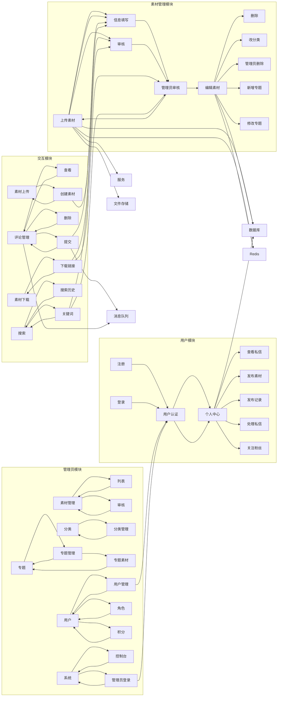

```mermaid
graph LR

%% 极致扁平化 全部横向 无上下层级
subgraph "用户模块"
A[注册] & C[登录] --> B[用户认证] --> D[个人中心]
D --> E[查看私信] & F[发布素材] & G[发布记录] & H[处理私信] & I[关注粉丝]
end

subgraph "素材管理模块"
J[上传素材] --> K[信息填写] & L[审核] --> S[管理员审核]
M[编辑素材] --> N[删除] & O[改分类] & P[管理员删除] & Q[新增专题] & R[修改专题]
end

subgraph "交互模块"
T[评论管理] --> U[查看] & V[提交] & W[删除]
X[素材下载] --> Y[下载链接]
Z[搜索] --> AA[关键词] & AB[搜索历史]
AC[素材上传] --> AD[创建素材]
end

subgraph "管理员模块"
AE[素材管理] --> AF[列表] & AG[审核]
AH[分类] --> AI[分类管理]
AJ[专题] --> AK[专题管理] --> AL[专题素材]
AM[用户] --> AN[用户管理] & AO[角色] & AP[积分]
AQ[系统] --> AR[控制台] & AS[管理员登录]
end

%% 底层全部压缩在同一水平线 高度最低
DB[数据库] & Cache[Redis] & Service[服务] & FS[文件存储] & Msg[消息队列]

%% 原有业务关联全部保留
B --> D
S --> J
S --> M
U --> T
V --> T
W --> T
Y --> X
AA --> Z
AB --> Z
AD --> AC
AF --> AE
AG --> AE
AI --> AH
AK --> AJ
AL --> AJ
AN --> AM
AO --> AM
AP --> AM
AR --> AQ
AS --> AQ

J --> K
V --> K
AD --> K
Y --> L
Y --> S
AA --> L
AA --> S
AN --> B
AS --> B

%% 底层依赖极简连线
J --> DB & Service & Cache & FS
M --> DB & Cache
V --> Msg
T --> Msg
D --> DB
```