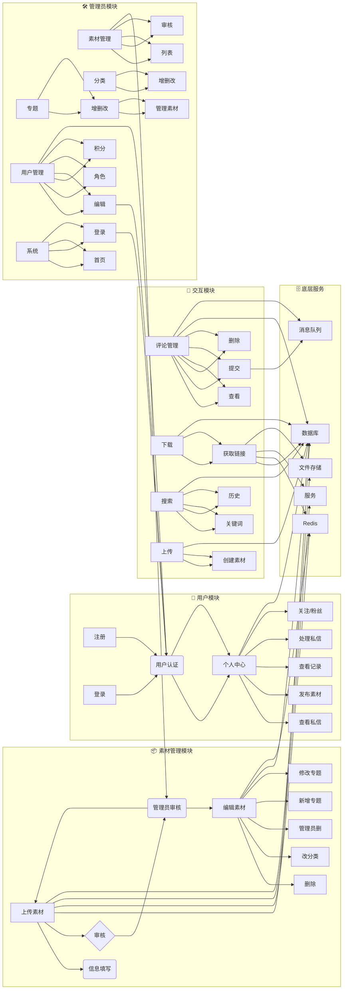

```mermaid
%%{ init: { 
  'flowchart': { 
    'htmlLabels': true,
    'nodeSpacing': 25,
    'rankSpacing': 45
  }
} }%%
graph LR

%% ========== 模块横向排列 ==========
subgraph "👤 用户模块"
    A[注册] --> B(用户认证)
    C[登录] --> B
    B --> D[个人中心]
    D --> E[查看私信]
    D --> F[发布素材]
    D --> G[查看记录]
    D --> H[处理私信]
    D --> I[关注/粉丝]
end

subgraph "📦 素材管理模块"
    J[上传素材] --> K(信息填写)
    J --> L{审核}
    L --> S(管理员审核)
    M[编辑素材] --> N[删除]
    M --> O[改分类]
    M --> P[管理员删]
    M --> Q[新增专题]
    M --> R[修改专题]
end

subgraph "🔗 交互模块"
    T[评论管理] --> U[查看]
    T --> V[提交]
    T --> W[删除]
    X[下载] --> Y[获取链接]
    Z[搜索] --> AA[关键词]
    Z --> AB[历史]
    AC[上传] --> AD[创建素材]
end

subgraph "🛠️ 管理员模块"
    AE[素材管理] --> AF[列表]
    AE --> AG[审核]
    AH[分类] --> AI[增删改]
    AJ[专题] --> AK[增删改]
    AK --> AL[管理素材]
    AM[用户管理] --> AN[编辑]
    AM --> AO[角色]
    AM --> AP[积分]
    AQ[系统] --> AR[首页]
    AQ --> AS[登录]
end

subgraph "🗄️ 底层服务"
    DB[数据库]
    Cache[Redis]
    Service[服务]
    FS[文件存储]
    Msg[消息队列]
end

%% ========== 核心业务连线（干净不乱） ==========
S --> J
S --> M

B --> D
T --> U
T --> V
T --> W
X --> Y
Z --> AA
Z --> AB
AC --> AD

AE --> AF
AE --> AG
AH --> AI
AJ --> AK
AK --> AL
AM --> AN
AM --> AO
AM --> AP
AQ --> AR
AQ --> AS

AN --> B
AS --> B
AE --> S
AM --> B

%% ========== 服务调用连线（极简版） ==========
J --> DB
J --> Cache
J --> Service
J --> FS

M --> DB
M --> Cache

Y --> DB
Y --> Cache
Y --> Service
Y --> FS

T --> DB
T --> Msg
V --> Msg

D --> DB
AC --> DB
Z --> DB
X --> DB
```