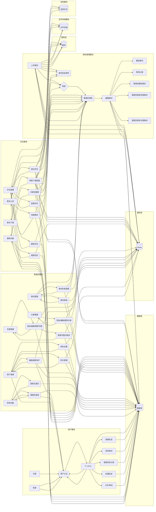

```mermaid
graph LR

subgraph "用户模块"
A[注册] --> B(用户认证)
C[登录] --> B
D[个人中心] --> B
D --> E[查看私信]
D --> F[发布素材]
D --> G[查看发布记录]
D --> H[处理私信]
D --> I["关注/粉丝"]
end


subgraph "素材管理模块"
J[上传素材] --> K(素材信息填写)
J --> L{审核}
M[编辑素材] --> N[删除素材]
M --> O[修改分类]
M --> P[管理员删除素材]
M --> Q[管理员新增专题素材]
M --> R[管理员修改专题素材]
L --> S(管理员审核)
end


subgraph "交互模块"
T[评论管理] --> U(查看评论)
T --> V(提交评论)
T --> W(删除评论)
X[素材下载] --> Y(获取下载链接)
Z[搜索功能] --> AA(关键词搜索)
Z --> AB(搜索历史)
AC[素材上传] --> AD(创建素材)
end


subgraph "管理员模块"
AE[素材管理] --> AF(素材列表管理)
AE --> AG(素材审核)
AH[分类管理] --> AI("添加/编辑/删除分类")
AJ[专题管理] --> AK("添加/编辑/删除专题")
AK --> AL(管理专题内素材)
AM[用户管理] --> AN("编辑/删除用户")
AM --> AO(角色设置)
AM --> AP(积分管理)
AQ[系统功能] --> AR(控制台首页)
AQ --> AS(管理员登录)
end


subgraph "数据层"
DB[("数据库")]
end

subgraph "缓存层"
Cache[("Redis")]
end

subgraph "服务层"
Service[("服务")]
end

subgraph "文件存储模块"
FS[("文件存储")]
end

subgraph "消息模块"
Msg[("消息队列")]
end


B --> D
S --> J
S --> M
U --> T
V --> T
W --> T
Y --> X
AA --> Z
AB --> Z
AD --> AC
AF --> AE
AG --> AE
AI --> AH
AK --> AJ
AL --> AJ
AN --> AM
AO --> AM
AP --> AM
AR --> AQ
AS --> AQ

J --> K
V --> K
AD --> K
Y --> L
Y --> S
AA --> L
AA --> S
U --> S
W --> S
V --> S
Y --> S
AD --> S
AF --> S
AG --> S
AN --> B
AS --> B

J --> DB
J --> Service
J --> Cache
J --> FS
M --> DB
M --> Cache
U --> DB
V --> DB
V --> Msg
W --> DB
Y --> DB
Y --> Service
Y --> Cache
Y --> FS
AA --> DB
AB --> DB
AD --> DB
AF --> DB
AG --> DB
AI --> DB
AK --> DB
AL --> DB
AN --> DB
AO --> DB
AP --> DB
AR --> DB
AS --> DB
D --> DB
E --> DB
F --> DB
G --> DB
H --> DB
I --> DB
T --> DB
X --> DB
Z --> DB
AC --> DB

J --> Cache
M --> Cache
Y --> Cache
AA --> Cache
AB --> Cache
AF --> Cache
AG --> Cache
AI --> Cache
AK --> Cache
AL --> Cache
AN --> Cache
AO --> Cache
AP --> Cache

J --> Service
Y --> Service
AC --> Service

J --> FS
Y --> FS
AC --> FS

V --> Msg
T --> Msg

D --> B
C --> B
AE --> S
AM --> B
AQ --> AS
```