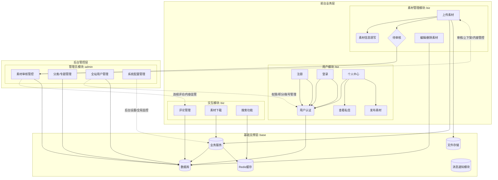

```mermaid
graph TB
    %% 全局样式+分层排版
    classDef biz fill:#f6f9ff,stroke:#2c5aa0
    classDef admin fill:#fff6f6,stroke:#a02c2c
    classDef base fill:#f6fff8,stroke:#2ca05c

    %% ========== 第一层：前台业务模块（上层） ==========
    subgraph "前台业务层"
    subgraph "用户模块"::biz
        A[注册] --> B(用户认证)
        C[登录] --> B
        D[个人中心] --> B
        D --> E[查看私信]
        D --> F[发布素材]
    end

    subgraph "素材管理模块"::biz
        J[上传素材] --> K(素材信息填写)
        J --> L{待审核}
        M[编辑/删除素材]
    end

    subgraph "交互模块"::biz
        T[评论管理]
        X[素材下载]
        Z[搜索功能]
    end
    end

    %% ========== 第二层：后台管理员管控（中层） ==========
    subgraph "后台管控层"
    subgraph "管理员模块"::admin
        AE[素材审核管控]
        AH[分类/专题管理]
        AM[全站用户管理]
        AQ[系统配置管理]
    end
    end

    %% ========== 第三层：底层支撑服务（下层） ==========
    subgraph "基础支撑层"::base
        DB[(数据库)]
        Cache[(Redis缓存)]
        Service[(业务服务)]
        FS[(文件存储)]
        Msg[(消息通知模块)]
    end

    %% ===================== 核心业务关联（精简、不冗余）=====================
    %% 前台 → 认证
    C --> B
    A --> B

    %% 素材流转
    L --> AE
    J --> Service
    J --> FS

    %% 内容交互
    T --> DB
    X --> Service
    Z --> Cache

    %% 管理员全局交互（对应你论文那段枢纽关系）
    %% 1.管理员 ↔ 素材管理
    AE -.->|审核/上下架/内容管控| J
    %% 2.管理员 ↔ 用户模块
    AM -.->|权限/积分/账号管理| B
    %% 3.管理员 ↔ 交互模块
    AE -.->|违规评论/内容监管| T
    %% 4.管理员 ↔ 系统配置
    AQ -.->|后台设置/全局监控| Service

    %% 底层统一依赖
    B --> DB
    M --> DB
    AE --> DB
    AH --> DB
    AM --> DB
    Service --> DB
    Service --> Cache
```